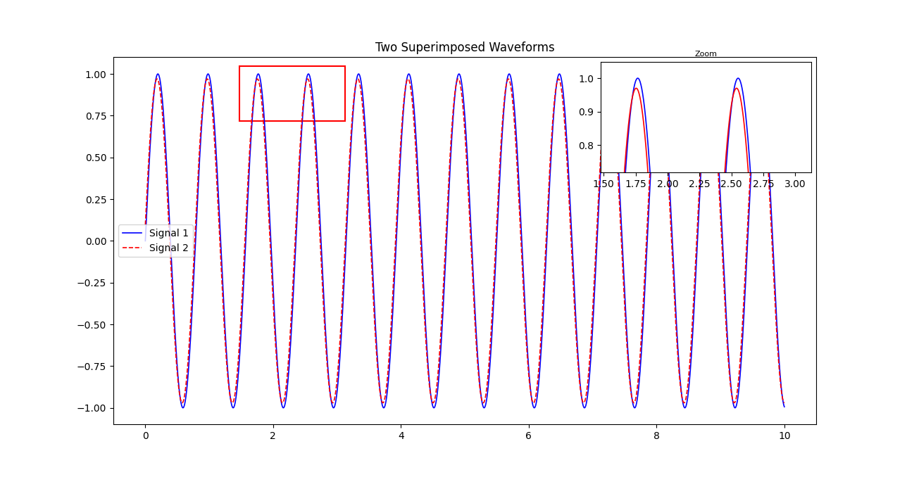

<<<<<<< HEAD
<<<<<<< HEAD
# zoomtool.py — Draggable, Resizable Zoom Window for Matplotlib

A lightweight Python library that adds a **draggable, resizable zoom window** to any Matplotlib plot — similar to MATLAB’s zoomed inset feature.

This tool lets you:
- Click and drag a rectangle on your plot  
- Resize the rectangle interactively  
- Automatically view a zoomed version in a floating inset window  
- Compare overlapping or nearly identical signals easily  

This project is a **clean Python re-implementation** inspired by the MATLAB version released here:  
https://github.com/thom7660/matlab_zoomed_axes

---

## ✨ Features

- 🟦 **Draggable zoom window** – click and move freely  
- ↔️ **Resizable corner** – drag to enlarge/shrink  
- 🔎 **Automatic inset zoom** – shows magnified region  
- 🎨 Works with any Matplotlib plot  
- 📦 Zero dependencies beyond Matplotlib  

---

## 📦 Installation

Install via pip (local install):

```bash
pip install .
=======
# zoomtool.py — Draggable, Resizable Zoom Window for Matplotlib

A lightweight Python library that adds a **draggable, resizable zoom window** to any Matplotlib plot — similar to MATLAB’s zoomed inset feature.

This tool lets you:
- Click and drag a rectangle on your plot  
- Resize the rectangle interactively  
- Automatically view a zoomed version in a floating inset window  
- Compare overlapping or nearly identical signals easily  

This project is a **clean Python re-implementation** inspired by the MATLAB version released here:  
https://github.com/thom7660/matlab_zoomed_axes

---

## ✨ Features

- 🟦 **Draggable zoom window** – click and move freely  
- ↔️ **Resizable corner** – drag to enlarge/shrink  
- 🔎 **Automatic inset zoom** – shows magnified region  
- 🎨 Works with any Matplotlib plot  
- 📦 Zero dependencies beyond Matplotlib  


---
## 📋 Requirements

- Python 3.7+
- Matplotlib 3.0+

---


## 📦 Installation

### Option 1: Clone from GitHub

```bash
git clone https://github.com/FahimeHajizadeh/python_zoomed_axes.git
cd python_zoomed_axes/zoomtool
```

Then import it locally:

```python
from zoomtool import zoom_window
```

### Option 2: Install from PyPI

```bash
pip install zoomtool
```

---

## 📖 API Reference

### `zoom_window(ax, zoom_factor=2.0, inset_size=(4, 3), box_color='blue', alpha=0.3)`

Activates the interactive zoom window on a given Matplotlib axes.

**Parameters:**
- `ax` (Matplotlib Axes): The axes object to attach the zoom window to
- `zoom_factor` (float, default=2.0): Magnification level for the inset
- `inset_size` (tuple, default=(4, 3)): Width and height of the inset window in figure coordinates
- `box_color` (str, default='blue'): Color of the selection rectangle
- `alpha` (float, default=0.3): Transparency of the selection rectangle (0–1)

**Returns:**
- None. Modifies the plot in-place with interactive handlers.

**Example with custom settings:**

```python
zoom_window(ax, zoom_factor=3.0, inset_size=(5, 4), box_color='red', alpha=0.2)
```


## 📜 License & Attribution

This project is licensed under the **MIT License** (see [LICENSE](https://github.com/FahimeHajizadeh/python_zoomed_axes/blob/main/license.txt) file in the repository).


**Inspired by:** MATLAB's zoomed inset feature implementation by [thom7660](https://github.com/thom7660) - [matlab_zoomed_axes](https://github.com/thom7660/matlab_zoomed_axes)  
**Python implementation:** [FahimeHajizadeh](https://github.com/FahimeHajizadeh)

---

## 🤝 Contributing

Contributions are welcome! Whether it's bug fixes, new features, or documentation improvements:

1. Fork the repository
2. Create a feature branch (`git checkout -b feature/my-feature`)
3. Commit your changes (`git commit -m 'Add my feature'`)
4. Push to the branch (`git push origin feature/my-feature`)
5. Open a Pull Request

**Found a bug?** Open an issue with:
- A minimal reproducible example
- Expected vs. actual behavior
- Your Python and Matplotlib versions

---

## 📝 Changelog

### v1.0.0 (Initial Release)
- Draggable zoom window
- Resizable corner handle
- Automatic inset zoom display
- Matplotlib integration

---


## 📧 Contact

For questions or suggestions, feel free to:
- Open an issue on [GitHub Issues](https://github.com/FahimeHajizadeh/python_zoomed_axes/issues)
- Reach out via [GitHub Discussions](https://github.com/FahimeHajizadeh/python_zoomed_axes/discussions)
- Email me at: fahime.hajizadeh@gmail.com
- Visit the repository: [FahimeHajizadeh/python_zoomed_axes](https://github.com/FahimeHajizadeh/python_zoomed_axes)

I'd love to hear your feedback and suggestions!


>>>>>>> 3b0f0e344369e77d6b38ce8e5e223f1058c7211e
=======
# zoomtool.py — Draggable, Resizable Zoom Window for Matplotlib

A lightweight Python library that adds a **draggable, resizable zoom window** to any Matplotlib plot — similar to MATLAB’s zoomed inset feature.

This tool lets you:
- Click and drag a rectangle on your plot  
- Resize the rectangle interactively  
- Automatically view a zoomed version in a floating inset window  
- Compare overlapping or nearly identical signals easily  



This project is a **clean Python re-implementation** inspired by the MATLAB version released here:  
https://github.com/thom7660/matlab_zoomed_axes

---

## ✨ Features

- 🟦 **Draggable zoom window** – click and move freely  
- ↔️ **Resizable corner** – drag to enlarge/shrink  
- 🔎 **Automatic inset zoom** – shows magnified region  
- 🎨 Works with any Matplotlib plot  
- 📦 Zero dependencies beyond Matplotlib  


---
## 📋 Requirements

- Python 3.7+
- Matplotlib 3.0+

---


## 📦 Installation

### Option 1: Clone from GitHub

```bash
git clone https://github.com/FahimeHajizadeh/python_zoomed_axes.git
cd python_zoomed_axes/zoomtool
```

Then import it locally:

```python
from zoomtool import zoom_window
```

### Option 2: Install from PyPI

```bash
pip install zoomtool
```

---

## 📖 API Reference

### `zoom_window(ax, zoom_factor=2.0, inset_size=(4, 3), box_color='blue', alpha=0.3)`

Activates the interactive zoom window on a given Matplotlib axes.

**Parameters:**
- `ax` (Matplotlib Axes): The axes object to attach the zoom window to
- `zoom_factor` (float, default=2.0): Magnification level for the inset
- `inset_size` (tuple, default=(4, 3)): Width and height of the inset window in figure coordinates
- `box_color` (str, default='blue'): Color of the selection rectangle
- `alpha` (float, default=0.3): Transparency of the selection rectangle (0–1)

**Returns:**
- None. Modifies the plot in-place with interactive handlers.

**Example with custom settings:**

```python
zoom_window(ax, zoom_factor=3.0, inset_size=(5, 4), box_color='red', alpha=0.2)
```


## 📜 License & Attribution

This project is licensed under the **MIT License** (see [LICENSE](https://github.com/FahimeHajizadeh/python_zoomed_axes/blob/main/license.txt) file in the repository).


**Inspired by:** MATLAB's zoomed inset feature implementation by [thom7660](https://github.com/thom7660) - [matlab_zoomed_axes](https://github.com/thom7660/matlab_zoomed_axes)  
**Python implementation:** [FahimeHajizadeh](https://github.com/FahimeHajizadeh)

---

## 🤝 Contributing

Contributions are welcome! Whether it's bug fixes, new features, or documentation improvements:

1. Fork the repository
2. Create a feature branch (`git checkout -b feature/my-feature`)
3. Commit your changes (`git commit -m 'Add my feature'`)
4. Push to the branch (`git push origin feature/my-feature`)
5. Open a Pull Request

**Found a bug?** Open an issue with:
- A minimal reproducible example
- Expected vs. actual behavior
- Your Python and Matplotlib versions

---

## 📝 Changelog

### v1.0.0 (Initial Release)
- Draggable zoom window
- Resizable corner handle
- Automatic inset zoom display
- Matplotlib integration

---


## 📧 Contact

For questions or suggestions, feel free to:
- Open an issue on [GitHub Issues](https://github.com/FahimeHajizadeh/python_zoomed_axes/issues)
- Reach out via [GitHub Discussions](https://github.com/FahimeHajizadeh/python_zoomed_axes/discussions)
- Email me at: fahime.hajizadeh@gmail.com
- Visit the repository: [FahimeHajizadeh/python_zoomed_axes](https://github.com/FahimeHajizadeh/python_zoomed_axes)

I'd love to hear your feedback and suggestions!


>>>>>>> 776a4fa776a68f3d9d367e28ba0c24441d6b1753
